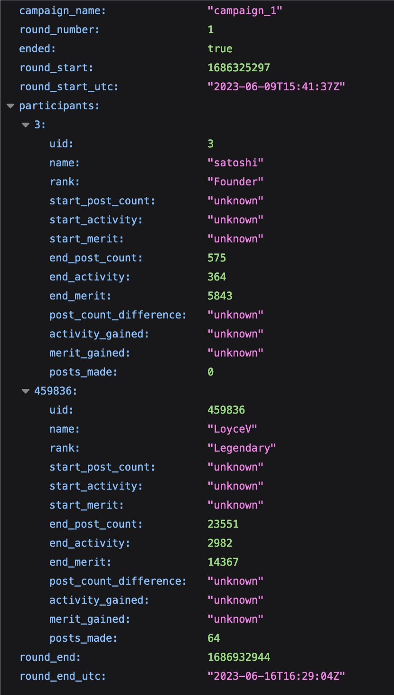
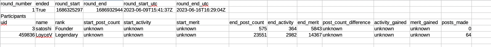

# Bitcointalk Campaign Manager

## General information

** NOTE, THE UTILITY IS STILL VERY MUCH A WORK IN PROGRESS AND USERS SHOULD NOT RELY ON IT TO BE BUG-FREE **

The Bitcointalk Campaign Manager is a Python utility developed to aid campaign managers on Bitcointalk to do their jobs more efficiently.

When managing campaigns, a lot of time is spent keeping track of user's post, activity and merit at the start and end of the campaign round. This utility will do that automatically by fetching data from Bitcointalk when starting a new round and then again when round is ended. It will also calculate the difference between end and the start.

In its present form, the utility will save campaign and round information into their corresponding folders in JSON format. Round data can be exported into CSV.

## Usage

Make sure you have required packages installed:

OPTIONALLY Start a new virtual environment:

(`python3 -m venv .venv`)
(`source .venv/bin/activate`)
Install prerequisites:
```pip install bs4 scrapy```

The main entry point to the program is the `main.py` file.

Simple help commands are available via

```python3 main.py --help```
or
```python3 main.py SUBCOMMAND --help```

The supported subcommands are `main.py campaign` and `main.py round`

Bitcointalk user UID is an integer round by taking a look at profile link of an user, for example UID of satoshi is 3:
https://bitcointalk.org/index.php?action=profile;u=3

Add new campaigns by:

```python3 main.py campaign add CAMPAIGN_NAME```

Add participants to a campaign by:

```python3 main.py campaign add_participant CAMPAIGN_NAME BITCOINTALK_UID```

<picture>
 
</picture>

Remove participants:

```python3 main.py campaign remove_participant CAMPAIGN_NAME BITCOINTALK_UID```

Start a new round:

```python3 main.py round add CAMPAIGN_NAME ROUND_NUMBER```

where ROUND_NUMBER can be any integer, for example start at 1 and then next add round 2 etc.

This will fetch current post count etc. for each user currently added into the campaign.

<picture>
 
</picture>

End round:

```python3 main.py round end CAMPAIGN_NAME ROUND_NUMBER```
This will fetch post scount etc. for each user that was in the campaign at the start of the round and update the information and count difference to start.

<picture>
 
</picture>

Save round information to CSV (can be done at start of round as well as end of round):
```python3 main.py round round_to_csv CAMPAIGN_NAME ROUND_NUMBER```

<picture>
 
</picture>

## Where information is saved

By default, information is saved into a new directory named `campaigns` in the directory where the program is ran.

In the campaigns folder is a `metadata.json` file where campaign information such as current round and participants are stored.

For each round a new directory is created and the name of the directory is the round number. Additionally, in this folder there will be a `round.json` file containing current information of the round as well as a round.csv file if the round_to_csv command was used. The CSV is currently written over for each time the command is used.

To summarize,

For campaign information check
`campaigns/metadata.json`

For round information check
`campaigns/ROUND_NUMBER/round.json or round.csv`

## Notes

As mentioned before, the program is a work in progress and much more functionality could be added.

Things I have planned:

- Posts users have made in a round will be fetched into a readable format for easy evaluation.
- View current participants using a command (currently need to check the metadata.json file)
